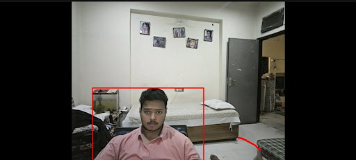
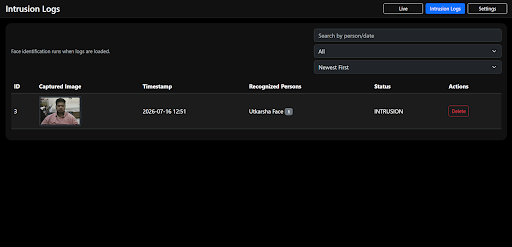
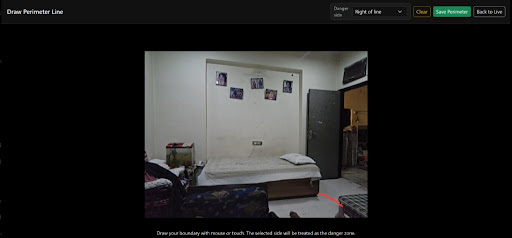
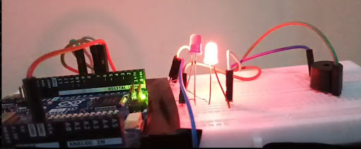
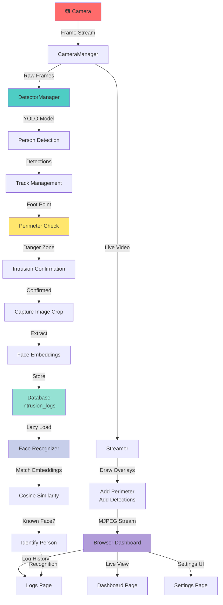

# 🎥 CVboundary

[](https://www.python.org/downloads/)
[](https://fastapi.tiangolo.com/)
[](https://opencv.org/)
[](https://ultralytics.com/)
[](LICENSE)
[](https://www.uvicorn.org/)

> **Real-time surveillance system with AI-powered intrusion detection, custom perimeter monitoring, and face recognition.**

CVboundary is a production-ready surveillance solution that combines real-time video analysis with intelligent boundary monitoring. Detect people entering designated danger zones, capture intrusions, identify individuals through face recognition, and manage everything through an intuitive web dashboard.

---

## ✨ Features

- 🎯 **Real-Time Person Detection** – YOLO11 detects people in live camera feed with 0.1s analysis interval
- 🔴 **Custom Perimeter Drawing** – Draw danger zones directly on the live video stream with configurable left/right danger side
- ⚠️ **Intrusion Confirmation** – Intelligent 1-second confirmation window prevents false positives
- 📸 **Automatic Capture** – Captures high-quality images of detected intruders automatically
- 👤 **Face Recognition** – Identifies known individuals using InsightFace embeddings with cosine similarity matching
- 📊 **Live MJPEG Streaming** – Real-time video feed rendered in browser with detection overlays and perimeter visualization
- 📋 **Intrusion Logging** – SQLite database stores complete intrusion history with timestamps, images, and recognition results
- 🖥️ **Interactive Dashboard** – Browser-based UI for live monitoring, settings, and intrusion log review
- 🔍 **Advanced Log Filtering** – Search by person name, filter by known/unknown/multiple identifications, sort by date
- 🎮 **Lazy Face Recognition** – Identifies people on-demand when viewing logs (keeps streaming smooth)
- ⚙️ **Configurable Thresholds** – Adjustable confidence levels, face similarity threshold (55% default), and analysis intervals
- 📁 **Known Face Library** – Load known face embeddings from disk to enable identification
- 🧹 **Clean Shutdown** – Daemon threads ensure graceful application termination with Ctrl+C

---

## 🎬 Demo

### 🎥 Live Demonstration

[LinkedIn Demo Video](https://www.linkedin.com/feed/update/urn:li:activity:7483440737460613120/)

### 📷 Screenshots

#### Intrusion Detection

*YOLO detection overlay showing person bounding boxes and danger zone perimeter visualization.*

#### Logs & Recognition

*Intrusion history with captured images, timestamps, recognized person names, and filter/search capabilities.*

#### Perimeter Settings

*Interactive canvas for drawing custom perimeter boundary with danger side selection.*

#### Hardware Demo

*Real-world deployment with detection and monitoring system.*

---

## 🏗️ Project Architecture



---

## 📈 Pipeline Workflow

### 🚀 Startup Phase
1. **FastAPI** server initializes with event handlers
2. **CameraManager** connects to local webcam (index 0)
3. **Streamer** prepares MJPEG encoder with 85% JPEG quality
4. **FaceRecognizer** loads known face embeddings from disk
5. **IntrusionDetector** starts capture and analysis background threads
6. Database is created/migrated if needed
7. Web server serves dashboard on `http://localhost:8000`

### 📹 Continuous Capture Loop
- **Camera Thread** reads frames from webcam at ~100 FPS
- Frames are locked and shared with detector and streamer
- If camera goes offline, status updates to "CAMERA OFFLINE"
- Thread checks for graceful shutdown signal every frame

### 🔍 Detection & Analysis Loop
- **Detector Thread** processes frames every 0.1 seconds (10 FPS)
- YOLO11x detects all people with confidence threshold (default 0.5)
- For each person, estimates foot point (center-bottom of bounding box)
- Checks if foot point lies in danger zone based on perimeter
- Tracks people across frames using distance-based matching (threshold: 150 pixels)

### ⚠️ Intrusion Decision Logic
- Person must stay in danger zone for ≥1 second to confirm intrusion
- Once confirmed, cropped image is captured
- Face embeddings extracted via InsightFace
- Intrusion logged to database with timestamp
- Webhook notification sent (if `ALARM_WEBHOOK_URL` configured)

### 🎨 Perimeter Management
- Users draw custom line on settings page
- Points normalized to 0-1 range (resolution-independent)
- Danger side selected: left or right of line
- Perimeter saved to `database/perimeter.json`
- Default perimeter at 25% of screen width if not configured

### 📊 Streaming & UI Rendering
- **Streamer** generates MJPEG at 0.03s intervals (~30 FPS)
- Draws perimeter line in red
- Draws detection boxes: red (danger) or green (safe)
- Sends to browser as multipart JPEG stream
- Dashboard renders with live status: camera state, intrusions today, system status

### 👤 Face Recognition
- **Lazy Loading:** Recognition runs only when logs page is viewed
- Loads embeddings from `intrusion_embeddings/` and `numpy-saves/`
- Compares against known embeddings using cosine similarity
- If similarity > 55% (configurable), person is identified
- Otherwise marked as "Unknown"
- Results cached in database for performance

### 📋 Logging & Persistence
- Intrusion data stored in SQLite: `database/database.db`
- Fields: ID, timestamp, image path, embeddings path, recognized person, status
- Images saved to `captured_intrusions/`
- Embeddings saved to `intrusion_embeddings/`
- Log entries searchable and filterable by person, date, status

---

## 📁 Folder Structure

```
CVboundary/
├── 🐍 Python Core
│   ├── app.py                    # FastAPI main application & routes
│   ├── camera.py                 # Webcam capture (daemon thread)
│   ├── detector.py               # YOLO detection + perimeter logic
│   ├── streamer.py               # MJPEG streaming generator
│   ├── perimeter.py              # Danger zone boundary management
│   ├── face_recognition.py       # Face embedding extraction & matching
│   ├── database.py               # SQLAlchemy setup & initialization
│   ├── models.py                 # IntrusionLog database model
│   ├── crud.py                   # Create/Read/Update/Delete operations
│   ├── config.py                 # Configuration constants
│   └── cosine.py                 # Cosine similarity calculation
│
├── 🌐 Web Interface (templates/)
│   ├── index.html                # Live dashboard page
│   ├── settings.html             # Perimeter drawing page
│   └── logs.html                 # Intrusion history & recognition results
│
├── 🎨 Frontend Assets (static/)
│   ├── css/
│   │   └── style.css             # Dark theme styling (Bootstrap 5)
│   └── js/
│       ├── settings.js           # Canvas drawing & perimeter save logic
│       └── logs.js               # Log filtering, search, modal display
│
├── 📦 Data Storage
│   ├── database/
│   │   ├── database.db           # SQLite intrusion logs
│   │   └── perimeter.json        # Saved perimeter coordinates
│   ├── captured_intrusions/      # JPEG images of detected intruders
│   ├── intrusion_embeddings/     # NumPy arrays of face embeddings
│   ├── known_faces/              # Reference images for identification
│   ├── numpy-saves/              # Pre-computed known face embeddings
│   └── MODELS/
│       └── yolo11x.pt            # YOLO11 model weights (~105 MB)
│
├── 📋 Configuration & Documentation
│   ├── requirements.txt           # Python dependencies
│   ├── PROJECT_PIPELINE.md        # Technical architecture overview
│   ├── README.md                  # This file
│   └── .venv-1/                  # Virtual environment
```

### Key Directories Explained

| Directory | Purpose |
|-----------|---------|
| `database/` | SQLite database and perimeter configuration |
| `captured_intrusions/` | JPEG snapshots of detected intruders |
| `intrusion_embeddings/` | NumPy files with face embeddings from intrusions |
| `known_faces/` | Reference images organized by person name (subdirectories) |
| `numpy-saves/` | Pre-computed embeddings for known individuals (.npy files) |
| `MODELS/` | Deep learning model weights (YOLO11x) |
| `templates/` | Jinja2 HTML templates for UI pages |
| `static/` | CSS styling and JavaScript interactivity |

---

## 🛠️ Technologies Used

| Technology | Purpose | Version |
|-----------|---------|---------|
| **FastAPI** | Web framework for REST API & routing | 0.139.0 |
| **Uvicorn** | ASGI server for running FastAPI | 0.51.0 |
| **OpenCV** | Webcam access, image processing, encoding | 5.0.0 |
| **Ultralytics YOLO** | Real-time person detection model | 8.4.95 |
| **InsightFace** | Face embedding extraction & analysis | 1.0.1 |
| **SQLAlchemy** | Object-relational mapping for database | 2.0.51 |
| **Jinja2** | HTML template rendering | 3.1.6 |
| **NumPy** | Numerical operations & embedding storage | (via insightface) |
| **SQLite** | Lightweight embedded database | (Python built-in) |
| **Bootstrap 5** | Frontend CSS framework | (CDN) |
| **Python** | Programming language | 3.9+ |

---

## 📥 Installation

### Prerequisites
- **Python 3.9** or higher
- **Webcam** connected to your machine
- **Windows, macOS, or Linux**

### Step 1: Clone Repository

```bash
git clone https://github.com/yourusername/CVboundary.git
cd CVboundary
```

### Step 2: Create Virtual Environment

```bash
# Windows
python -m venv .venv-1
.\.venv-1\Scripts\activate

# macOS/Linux
python3 -m venv .venv-1
source .venv-1/bin/activate
```

### Step 3: Install Dependencies

```bash
pip install -r requirements.txt
```

**Note:** InsightFace requires downloading model files on first run (~500 MB). This happens automatically.

### Step 4: Download YOLO Model

```bash
# Downloads yolo11x.pt to MODELS/ directory automatically on first run
python -c "from ultralytics import YOLO; YOLO('yolo11x.pt')"
```

Or manually place `yolo11x.pt` in the `MODELS/` folder.

### Step 5: Run the Application

```bash
# Using Uvicorn
uvicorn app:app --host 0.0.0.0 --port 8000 --reload

# Or using Python directly
python -m uvicorn app:app --host 0.0.0.0 --port 8000
```

### Step 6: Access Dashboard

Open your browser and navigate to:

```
http://localhost:8000
```

You should see:
- ✅ **Live Dashboard** – Real-time webcam feed with detection overlays
- ✅ **Settings Page** – Click "Settings" tab to draw perimeter
- ✅ **Logs Page** – Click "Intrusion Logs" to view history & recognized people

### Stop the Application

```bash
# Press Ctrl+C in the terminal
# All background threads will gracefully shut down
```

---

## ⚙️ Configuration

All settings are defined in **`config.py`**. Edit this file to customize behavior:

```python
# Model & Detection
YOLO_MODEL_PATH = "MODELS/yolo11x.pt"
CONFIDENCE_THRESHOLD = 0.5          # YOLO detection confidence (0-1)
ANALYSIS_INTERVAL_SECONDS = 0.1     # Frame analysis rate (10 FPS)

# Perimeter & Thresholds
BOUNDARY_PERCENTAGE = 0.25          # Default perimeter at 25% screen width
FACE_SIMILARITY_THRESHOLD = 0.55    # Face recognition match threshold (0-1)

# Directories
DATABASE_PATH = "database/database.db"
KNOWN_FACES_DIR = "known_faces/"    # Reference images for identification
EMBEDDINGS_DIR = "numpy-saves/"     # Pre-computed embeddings
CAPTURED_IMAGES_DIR = "captured_intrusions/"
INTRUSION_EMBEDDINGS_DIR = "intrusion_embeddings/"
PERIMETER_FILE = "database/perimeter.json"
```

### Key Configuration Options

| Setting | Default | Description |
|---------|---------|-------------|
| `CONFIDENCE_THRESHOLD` | 0.5 | Lower = more detections but more false positives |
| `ANALYSIS_INTERVAL_SECONDS` | 0.1 | Lower = more frequent analysis (more CPU) |
| `BOUNDARY_PERCENTAGE` | 0.25 | Initial perimeter position (25% from left) |
| `FACE_SIMILARITY_THRESHOLD` | 0.55 | Higher = stricter face matching |

### Environment Variables

Set optional webhook for alarm notifications:

```bash
export ALARM_WEBHOOK_URL=https://your-webhook-endpoint.com/webhook
```

If set, sends `{"value": 1}` on intrusion detection.

---

## 🔍 How Intrusion Detection Works

### Person Detection (YOLO)

1. **Model:** Ultralytics YOLOv11 (yolo11x.pt)
2. **Input:** Live camera frames at 0.1s intervals
3. **Output:** Bounding boxes with confidence scores
4. **Filtering:** Only boxes with confidence > threshold (default 0.5)
5. **Classes:** Only "person" class (index 0) is detected

### Foot Point Estimation

- **Calculation:** `foot_point = (box_center_x, box_bottom_y)`
- **Formula:** 
  ```
  foot_x = (x1 + x2) / 2
  foot_y = y2  (bottom edge of bounding box)
  ```
- **Rationale:** Foot point is most reliable indicator of position in frame

### Perimeter & Danger Zone

- **Perimeter:** User-drawn polyline with 2+ points
- **Normalization:** Points stored as (0-1) coordinates (resolution-independent)
- **Danger Side:** User selects "left" or "right" of the line
- **Detection:** Interpolates boundary at person's Y-coordinate, checks if X is on danger side

### Intrusion Confirmation

1. Person detected in danger zone
2. **Confirmation window:** Must stay in danger zone for ≥1.0 second
3. **Tracking:** Person tracked via distance-matching (150px threshold)
4. **Confirmed:** After 1 second, intrusion is logged
5. **Capture:** Image cropped and embedding extracted

### Why This Works

- ⏱️ **1-second window** prevents false positives from people passing through
- 🎯 **Foot point** is more accurate than box center for zone detection
- 📍 **Normalized coordinates** work at any camera resolution
- 🔄 **Tracking** maintains person identity across frames

---

## 👤 Face Recognition Pipeline

### Embedding Extraction

- **Model:** InsightFace buffalo_l (R50 backbone)
- **Input:** Cropped person image
- **Output:** 512-dimensional embedding vector
- **Framework:** ONNX runtime with CPU execution

### Known Faces Loading

Two methods to provide reference embeddings:

#### Method 1: Pre-computed Embeddings (Recommended)
```
numpy-saves/
├── John_Doe.npy           # 1D or 2D array of embeddings
├── Jane_Smith.npy
└── Unknown_Person.npy
```

File naming converted: `John_Doe.npy` → "John Doe" identity

#### Method 2: Reference Images
```
known_faces/
├── John_Doe/
│   ├── photo1.jpg
│   ├── photo2.jpg
│   └── photo3.jpg
├── Jane_Smith/
│   ├── photo1.jpg
│   └── photo2.jpg
```

Embeddings extracted from images on app startup

### Recognition Algorithm

```
For each intrusion embedding:
  1. Loop through all known embeddings
  2. Compute cosine_similarity(intrusion_embedding, known_embedding)
  3. Track highest similarity score
  4. If max_score >= THRESHOLD (55%):
       → Return person name
     Else:
       → Return "Unknown"
```

### Cosine Similarity Formula

$$\text{similarity}(a, b) = \frac{a \cdot b}{|a| \cdot |b|}$$

Where:
- $a \cdot b$ = dot product
- $|a|$, $|b|$ = vector magnitudes

**Range:** [0, 1] where 1 = identical vectors

### Configuration

| Setting | Default | Impact |
|---------|---------|--------|
| `FACE_SIMILARITY_THRESHOLD` | 0.55 | Higher = fewer false positives, more unknowns |
| InsightFace model | buffalo_l | Balanced speed/accuracy |
| CPU provider | CPUExecutionProvider | Works on any machine |

---

## 💾 Database Schema

### IntrusionLog Table

```sql
CREATE TABLE intrusion_logs (
  id INTEGER PRIMARY KEY AUTOINCREMENT,
  timestamp VARCHAR(50) NOT NULL,        -- "2024-07-17 14:30"
  image_path VARCHAR(255) NOT NULL,      -- "captured_intrusions/person_20240717_143045_123456.jpg"
  embeddings_path VARCHAR(255),          -- "intrusion_embeddings/person_20240717_143045_123456.npy"
  recognized_people VARCHAR(255),        -- "John Doe" or "Unknown" or "Pending"
  status VARCHAR(50) DEFAULT "INTRUSION", -- Always "INTRUSION"
  created_at DATETIME DEFAULT NOW()       -- Database record creation time
);
```

### Storage Examples

| Field | Example |
|-------|---------|
| timestamp | `2024-07-17 14:30` |
| image_path | `captured_intrusions/person_20240717_143045_234156.jpg` |
| embeddings_path | `intrusion_embeddings/person_20240717_143045_234156.npy` |
| recognized_people | `John Doe` \| `Unknown` \| `Pending` |

### Intrusion Lifecycle

1. **Detection:** Image + Embedding captured → Status = "INTRUSION"
2. **Pending:** `recognized_people` = "Pending"
3. **On Log View:** Face recognition runs (lazy) → `recognized_people` updated
4. **Result:** Either person name or "Unknown"

---

## 🖥️ API Endpoints

### Web Pages (HTML)

```
GET  /                      # Live dashboard
GET  /settings              # Perimeter drawing
GET  /logs                  # Intrusion history
```

### Video Streaming

```
GET  /video_feed            # MJPEG stream (multipart/x-mixed-replace)
GET  /api/settings/frame    # Single frame for settings canvas
```

### Perimeter API

```
GET    /api/perimeter       # Get current perimeter & danger_side
POST   /api/perimeter       # Save new perimeter
DELETE /api/perimeter       # Clear perimeter
```

### Intrusion Logs API

```
GET    /captures/{image_name}   # Fetch captured image by filename
```

### Internal Routes

```
GET    /api/intrusion/logs       # Fetch logs with filters (used by frontend)
```

---

## 🧵 Threading Model

The application uses **daemon threads** for background workers to ensure clean shutdown:

### Thread Management

| Thread | Purpose | Daemon | Timeout |
|--------|---------|--------|---------|
| **camera-capture** | Read webcam frames | ✅ Yes | 1.0s |
| **detector-capture** | Copy raw frames | ✅ Yes | 1.0s |
| **detector-analysis** | Run YOLO & perimeter logic | ✅ Yes | 1.0s |
| **intrusion-worker** | Save image & embeddings | ✅ Yes | - |

### Shutdown Behavior

```python
# When Ctrl+C is pressed:
1. app.on_event("shutdown") triggers
2. detector.stop() sets _stop_event
3. All loops check _stop_event.is_set()
4. Threads gracefully exit
5. Thread joins with 1.0s timeout
6. App terminates cleanly
```

No more "waiting for application to finish" messages!

---

## 📊 Performance Tuning

### Optimize for Speed

```python
# In config.py:
CONFIDENCE_THRESHOLD = 0.4          # Lower threshold = more detections
ANALYSIS_INTERVAL_SECONDS = 0.2     # Slower analysis = lower CPU
FACE_SIMILARITY_THRESHOLD = 0.50    # Lower = more matches
```

### Optimize for Accuracy

```python
# In config.py:
CONFIDENCE_THRESHOLD = 0.6          # Higher threshold = fewer false positives
ANALYSIS_INTERVAL_SECONDS = 0.05    # Faster analysis = more responsive
FACE_SIMILARITY_THRESHOLD = 0.65    # Higher = stricter matching
```

### Hardware Requirements

| Component | Minimum | Recommended |
|-----------|---------|-------------|
| CPU | 2 cores | 4+ cores |
| RAM | 4 GB | 8 GB |
| Storage | 10 GB | 50 GB |
| Camera | 30 FPS | 60 FPS |

---

## 🚀 Deployment Options

### Local Development

```bash
uvicorn app:app --reload
```

### Production (Systemd)

Create `/etc/systemd/system/cvboundary.service`:

```ini
[Unit]
Description=CVboundary Surveillance System
After=network.target

[Service]
Type=simple
User=cvboundary
WorkingDirectory=/opt/cvboundary
ExecStart=/opt/cvboundary/.venv-1/bin/uvicorn app:app --host 0.0.0.0 --port 8000
Restart=always
RestartSec=10

[Install]
WantedBy=multi-user.target
```

Then:

```bash
sudo systemctl enable cvboundary
sudo systemctl start cvboundary
```

### Docker (Optional)

Create `Dockerfile`:

```dockerfile
FROM python:3.11-slim
WORKDIR /app
COPY requirements.txt .
RUN pip install -r requirements.txt
COPY . .
CMD ["uvicorn", "app:app", "--host", "0.0.0.0", "--port", "8000"]
```

Build and run:

```bash
docker build -t cvboundary .
docker run -it --device /dev/video0 -p 8000:8000 cvboundary
```

---

<details>
<summary><b>🔮 Future Improvements</b></summary>

- [ ] **Multi-Camera Support** – Monitor multiple webcams simultaneously
- [ ] **GPU Acceleration** – CUDA/TensorRT for faster inference
- [ ] **Email Alerts** – Send notifications with snapshot on detection
- [ ] **SMS Notifications** – Twilio integration for mobile alerts
- [ ] **WebSocket Streaming** – Lower latency than MJPEG
- [ ] **Analytics Dashboard** – Charts, heatmaps, detection statistics
- [ ] **Role-Based Access** – Admin, viewer, editor roles
- [ ] **Cloud Storage** – AWS S3 backup for intrusion images
- [ ] **Mobile App** – Native iOS/Android monitoring
- [ ] **Better Tracking** – Kalman filtering for smoother person tracks
- [ ] **Audio Alerts** – Audible alarm on detection
- [ ] **VPN/SSH Tunnel** – Secure remote access
- [ ] **Encryption** – Encrypted database & image storage
- [ ] **Dark Net Deployment** – Tor integration for privacy

</details>

---

## 📝 License

This project is licensed under the **MIT License**. See [LICENSE](LICENSE) file for details.

```
MIT License

Permission is hereby granted, free of charge, to any person obtaining a copy
of this software and associated documentation files (the "Software"), to deal
in the Software without restriction, including without limitation the rights
to use, copy, modify, merge, publish, distribute, sublicense, and/or sell
copies of the Software, and to permit persons to whom the Software is
furnished to do so, subject to the following conditions:

The above copyright notice and this permission notice shall be included in all
copies or substantial portions of the Software.
```

---

## 👨‍💻 Author

**Utkarsha Boundary Surveillance**

- 🔗 **GitHub:** [@yourgithub](https://github.com/yourgithub)
- 💼 **LinkedIn:** [Your LinkedIn Profile](https://linkedin.com/in/yourprofile)
- 📧 **Email:** your.email@example.com

---

## 🤝 Contributing

Contributions are welcome! Please feel free to:

1. **Fork** the repository
2. **Create** a feature branch (`git checkout -b feature/amazing-feature`)
3. **Commit** your changes (`git commit -m 'Add amazing feature'`)
4. **Push** to the branch (`git push origin feature/amazing-feature`)
5. **Open** a Pull Request

---

## 📚 Additional Resources

- [FastAPI Documentation](https://fastapi.tiangolo.com/)
- [Ultralytics YOLOv11](https://docs.ultralytics.com/)
- [InsightFace GitHub](https://github.com/deepinsight/insightface)
- [OpenCV Documentation](https://docs.opencv.org/)
- [SQLAlchemy ORM](https://docs.sqlalchemy.org/)

---

## ⚠️ Troubleshooting

### Camera Not Detected

```bash
# Check if camera is accessible
python -c "import cv2; cap = cv2.VideoCapture(0); print(cap.isOpened())"
```

### High CPU Usage

- Increase `ANALYSIS_INTERVAL_SECONDS` in config.py
- Lower `CONFIDENCE_THRESHOLD` to reduce YOLO computations
- Use GPU acceleration if available

### Face Recognition Not Working

- Ensure `known_faces/` or `numpy-saves/` directories exist
- Check folder structure: `known_faces/PersonName/*.jpg`
- Lower `FACE_SIMILARITY_THRESHOLD` for more lenient matching

### Ctrl+C Not Stopping App

- Check that all threads have `daemon=True`
- Verify `_stop_event.set()` is called in shutdown handler
- Increase thread join timeout if needed

---

<div align="center">

**Made with ❤️ by Utkarsha**

[⬆ back to top](#cvboundary)

</div>
